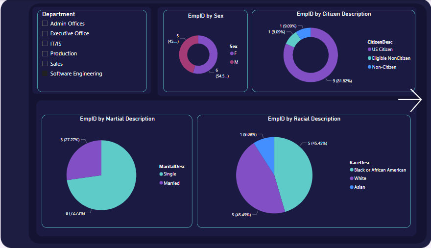

# HR Analytics Dashboard using Power BI

## Overview

This repository contains a Power BI file that presents an HR Analytics dashboard, providing insights into employee data and trends within the organization. The dashboard utilizes Power BI's interactive visualizations to present information in a user-friendly manner.

## Features

- Interactive visualizations showcasing various HR metrics and trends.
- Data-driven insights into employee demographics, performance, and more.
- Drill-down capabilities for deeper analysis.
- Regular updates with the latest data.

## Getting Started

Follow these steps to set up and explore the HR Analytics dashboard:

1. **Clone or Download**: Clone this repository to your local machine or download the Power BI file directly from the repository.

2. **Open the Power BI File**: Use Power BI Desktop to open the downloaded `.pbix` file.

3. **Data Connection**: Ensure that your Power BI file is connected to the relevant HR data source. If needed, update the data connection settings.

4. **Refresh Data**: If you're using a live or dynamic data source, make sure to refresh the data in Power BI to get the most up-to-date information.

5. **Explore the Dashboard**: Navigate through the various tabs and visualizations to explore different aspects of HR analytics. Use the filters and interactions to customize your view.

6. **Interact and Analyze**: Leverage the interactive features to drill down into specific data points and gain insights into HR trends.

## Requirements

- Power BI Desktop: You need Power BI Desktop to open and interact with the dashboard.
- HR Data Source: Make sure you have access to the HR data source that the dashboard is connected to.

This project is licensed under the [MIT License](LICENSE).

---

Designed and developed by [Vineet Kukreti](https://github.com/vineetkukreti)
